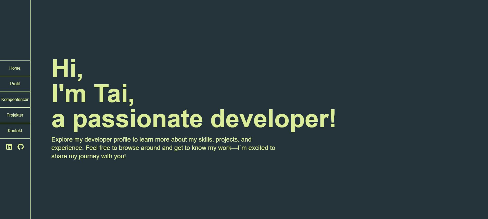

## About

This project is my personal developer profile, built using Next.js and React. Here, you can explore my professional background, skills (with a focus on JavaScript, TypeScript, C#, React, and Next.js), and projects. 
The site includes dedicated sections for my profile, competencies, projects, and contact information, all styled with Tailwind CSS. Feel free to browse around and get to know my work and journey as a developer!

## Features

- Responsive design with Next.js and Tailwind CSS
- Custom interactive components (e.g., EscapeButton)
- Skills and projects showcase
- Contact form for direct communication

## Technologies

- Next.js
- React
- TypeScript
- Tailwind CSS

## Screenshots

## Folder Structure

- `/src/app/pages` — Main pages (Profile, Skills, Projects, Contact)
- `/src/app/components` — Reusable UI components
- `/public` — Static assets
