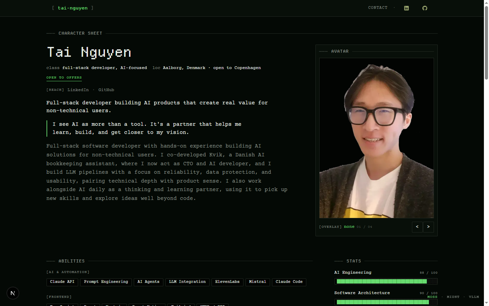

# Tai Nguyen · Developer Profile

Personal developer profile site presented as an RPG character sheet: stats, traits, abilities, a campaign log (experience), and a quest log (projects). The RPG conceit lives in the content; the visual system is "Terminal Archive": dark-first, low-chroma OKLCH color, mono typography, 1px hairlines, and block-element progress bars (see `DESIGN_GUIDE.md`).

**Live:** https://portfolio-tai.vercel.app

## Screenshot



Full page: [Screenshots/home-full.png](my-dev-profile/Screenshots/home-full.png)

## Features

- Character-sheet layout: stats bars, abilities, campaign log, tiered quest log (featured / also built)
- Three switchable themes (moss, midnight, vellum) with a no-flash inline script and localStorage persistence
- Responsive design, semantic spacing/type tokens, WCAG AA-checked ink ramps
- Self-hosted mono fonts (Courier Prime, Departure Mono)

## Technologies

- Next.js 15 (App Router)
- React 19
- TypeScript (strict)
- Tailwind CSS v4 (CSS-first config, no `tailwind.config.js`)

## Getting started

```bash
cd my-dev-profile
npm install
npm run dev   # http://localhost:3000
```

## Folder structure

- `my-dev-profile/src/app/pages` — Route pages (Profile, Contact)
- `my-dev-profile/src/app/components` — Reusable UI components
- `my-dev-profile/public` — Static assets (fonts, icons, images)
